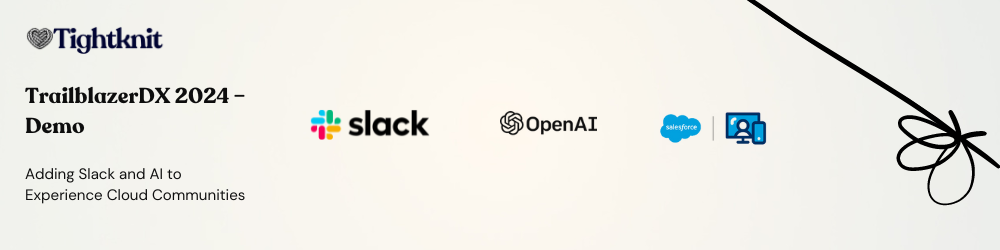
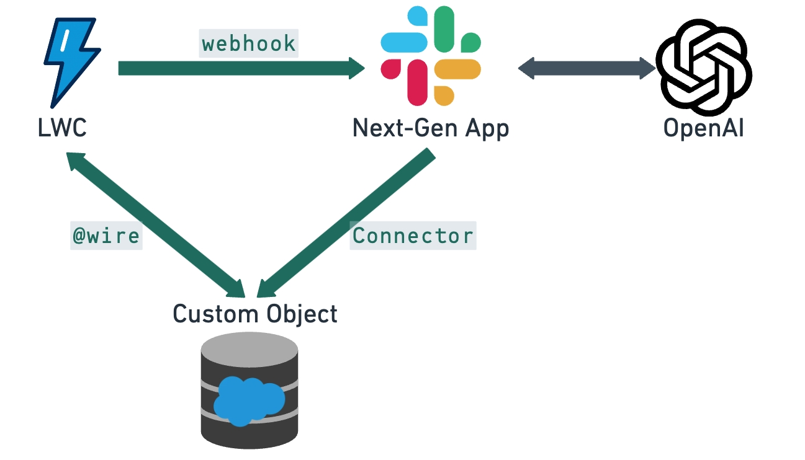

## TDX 2024 - Demo

[![Button Icon]][Link]

This repo contains a collection of sample apps that can be deployed to create a simple chat messaging system between a Lightning Web Component (LWC) on a Salesforce Digital Experience site and a Slack Next Gen App, backed by a custom object within your Salesforce org.

The use case presented here is a chat support ticketing system where service agents on Slack are able to communicate with end users on your Salesforce website, using AI to generate Knowledge Articles from the information capture in the resolved conversation.

## Watch a Demo

*Coming soon!*

## Using this example

### Slack

Follow the instructions [here](../apps/slack-app/README.md) to setup and deploy your Next-Gen Slack app.

### Salesforce

Follow the instructions [here](../apps/salesforce-app/README.md) to setup and deploy your Salesforce custom objects, LWR Experience Cloud site, and LWC.

## Useful Links

Learn more about the apps and components in this repo:

- [Next-generation Slack platform](https://api.slack.com/start#next-gen-platform)
- [Slack Connector functions](https://api.slack.com/automation/connectors)
- [Salesforce Lightning Web Components (LWC)](https://developer.salesforce.com/developer-centers/lightning-web-components)
- [lightning/uiRecordApi wire adapter (LWC)](https://developer.salesforce.com/docs/platform/lwc/guide/reference-lightning-ui-api-record.html)
- [OpenAI Chat Completions API](https://platform.openai.com/docs/api-reference/chat)

<!----------------------------------------------------------------------------->
[Link]: # 'Link with example title.'

<!---------------------------------[ Buttons ]--------------------------------->
[Button Icon]: https://img.shields.io/badge/Join_the_community-37a779?style=for-the-badge&logoColor=white&logo=Slack